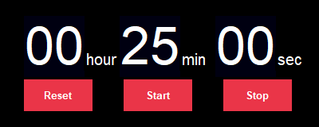

# sTimer

sTimer is a timing pomotroid with minimum features. It takes config from `cfg.ini` file and run with command `python stimer.py`.

Its GUI looks like this:

To install dependency, run `pip install -r requirement`.

Notice: The default audio comes from [pomotroid](https://github.com/Splode/pomotroid/tree/master/static/audio).
You can also customize the alarm sound by replacing the default mp3 and trim time of the alarm:
`ffmpeg -i battleship-alarm.wav -t 2 alert.mp3`